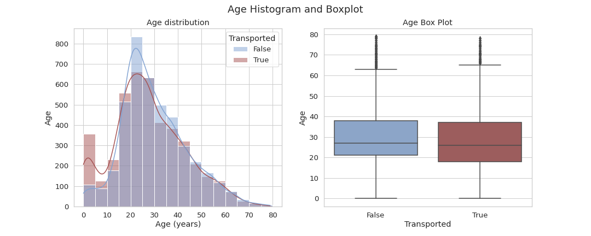
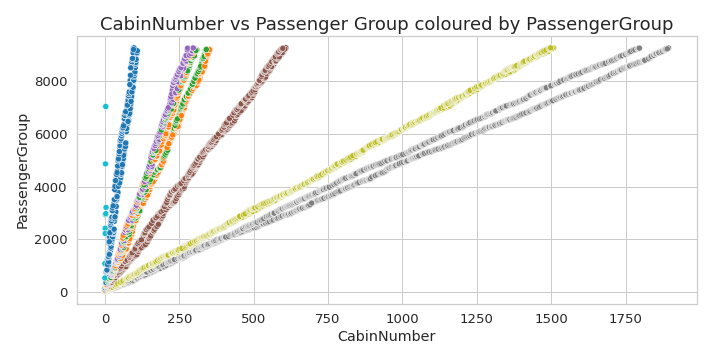

# Spaceship Titanic Prediction
---

 Focus on data cleaning, feature relationship, missing values, data cleaning, feature engineering and modeling pipelines with very useful visuals. 

* The data can we downloaded in [Kaggle](https://www.kaggle.com/competitions/spaceship-titanic)

 
 

 
 

 
<table><tr>
<td></td>
<td>  </td>
</tr><table>
<tr><table>
<td></td>
<td></td>
<tr><table>

 
 
 

