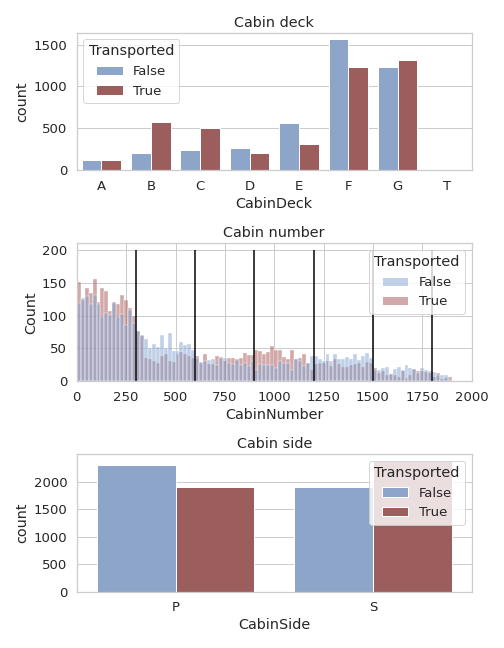

# Spaceship Titanic Prediction
---

](https://colab.research.google.com/drive/1GgTDc8bqNdoxLfQ9bRVZQ1OFKEhcYz4x#scrollTo=kpC_nDA0OkkQ&uniqifier=1)

 Focus on data cleaning, feature relationship, missing values, data cleaning, feature engineering and modeling pipelines with very useful visuals. 
    

 

---

